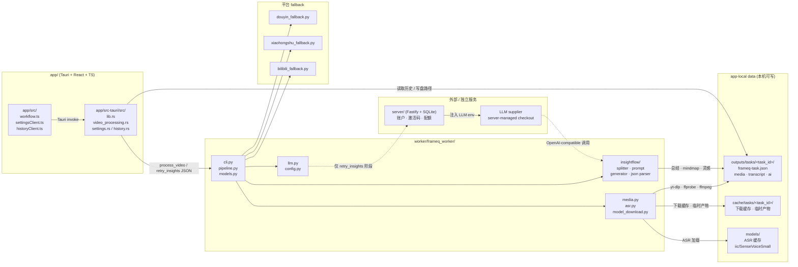

# FrameQ Architecture

## 2026-07-08 Split Summary and Inspiration Generation Boundary

- `retry_insights` now receives an explicit target: `summary` or `insights`. The command still reuses the saved official transcript and the owning task manifest; it must not re-download media or rerun ASR.
- The `summary` target generates only `ai/summary.md` and hidden `ai/mindmap.mmd`. It must not accept, read, write, or prompt with the personalized preference snapshot.
- The `insights` target generates only `ai/insights.json` and `ai/insights.md`. It may persist `ai/preference-snapshot.json` and may include that snapshot only in insight-topic prompts.
- Retrying either target must merge existing AI artifacts from the same task directory before writing `frameq-task.json`, so generating one output cannot clear the other output or reset `insights_count`.
- Each user confirmation uses server-managed LLM checkout and consumes quota per actual supplier API-call attempt for that target.

## 2026-07-06 Personalized Insight Preferences Boundary

- The desktop UI owns the inspiration-profile setup flow, the per-run six-step generation-preference wizard, confirmation summaries, and result-detail actions such as `换个方向`.
- Tauri owns app-local persistence for the inspiration profile. The profile should be stored as a constrained local JSON file, not in app-local `.env`, and Tauri commands must validate the file path under app-local data.
- If the user skips profile setup, Tauri persists a local skipped marker such as `profileSkipped: true` without profile fields. This marker suppresses repeated first-use prompts but must not create an implicit default persona.
- The per-run preference snapshot is passed to `retry_insights` only when the target is `insights`, together with the saved official transcript reference. It may be recorded in the local task manifest as user-visible context for already-generated inspiration artifacts.
- The worker treats profile and generation preferences as structured prompt context for insight-topic generation only. Summary and Mermaid mindmap generation continue to use the generic AI整理 prompts and must not read the personalized preference snapshot. The worker must not infer hidden preferences from unrelated history.
- For insight-topic generation, the worker should preserve LLM context budget by using transcript chunks, summaries, or candidate excerpts plus a compact structured preference JSON. It should not concatenate a full long transcript and verbose preference prose into a single prompt.
- FrameQ server continues to own only account, entitlement, quota, and LLM checkout. It must not receive or store inspiration profiles, generation preferences, transcripts, generated insights, or local task manifests.
- Quota is counted per cloud LLM API call attempt: `1 quota use = 1 supplier chat-completion/API call attempt`. Summary generation, Mermaid mindmap generation, topic planning, and insight-topic generation may each consume separate quota uses only when their target is confirmed. Re-running via `换个方向` starts a new confirmed `insights` target attempt and consumes quota again according to its actual LLM calls. Failed, timed-out, unparsable, or partially failed calls remain consumed once attempted.
- The LLM supplier may receive transcript snippets only after the user confirms the corresponding AI target. The selected preference snapshot may be sent only with the insight-topic generation request, not with summary or Mermaid mindmap requests.

## 2026-07-05 Desktop Diagnostics Boundary

- The Tauri desktop layer owns app-local diagnostic logs at `logs/frameq-desktop.log`.
- Diagnostics record desktop command lifecycle, worker exit status, task id, structured error code, and sanitized short messages.
- Worker task diagnostics remain under app-local `cache/tasks/<task_id>/` when task-specific temporary evidence is needed; desktop logs are global support evidence, not user artifacts.
- YouTube extraction may explicitly enable local JavaScript runtimes supported by `yt-dlp` (`deno`, `node`, `quickjs`, `bun`) but must still run as a worker-owned public-link download policy.
- Release packages bundle Deno in `resources/bin` so clean Windows and macOS machines have a local JavaScript runtime available for `yt-dlp` YouTube player evaluation.

## 2026-07-05 Task-Owned Artifact Store Boundary

- A processing run is now a first-class task. The worker creates `<output_root>/tasks/<task_id>/frameq-task.json` and writes all final user artifacts under that same task directory.
- Final artifacts use stable names inside task folders: `media/video.mp4`, `media/audio.wav`, `transcript/transcript.txt`, `transcript/transcript.md`, `transcript/segments.json`, `ai/summary.md`, `ai/mindmap.mmd`, `ai/insights.json`, and `ai/insights.md`.
- App-local `cache/tasks/<task_id>/` owns temporary downloads, partial files, media merge scratch space, and diagnostics. It is not the user-facing artifact contract.
- `frameq-task.json` is the source of truth for desktop history and artifact lookup. Any app-local cache index is rebuildable, not the authority.
- Tauri may satisfy a repeated source URL from an existing completed or partial-completed task manifest when the transcript artifact still exists. This cache hit returns the existing task result before worker launch; unusable or broken old tasks are skipped.
- Tauri commands should resolve artifacts from `task_id` and manifest-relative paths only. They must not accept arbitrary transcript/audio/result paths for normal task operations.
- The old flat-output/history contract is intentionally retired for new builds. Legacy flat outputs and legacy app-local history records do not need migration or compatibility behavior.

## 2026-07-05 Subtitle-First Transcript Source Boundary

- The worker may request public platform subtitle files for YouTube and Bilibili `yt-dlp` success paths before loading ASR. This is a worker-owned transcript optimization, not a new UI platform crawler or download workflow.
- Subtitle probing runs after media validation/audio extraction and before ASR model readiness/loading checks. This preserves the current `media/video.mp4`, `media/audio.wav`, audio review, result cards, and history behavior while skipping only ASR model load/inference when subtitles are usable.
- Bilibili public fallback does not fetch or reuse subtitles in v1. If `yt-dlp` fails and `download_bilibili_video` succeeds, the task continues through the existing ASR path.
- Subtitle parsing writes the same official `transcript/transcript.txt`, `transcript/transcript.md`, and `transcript/segments.json` artifacts as ASR. Later AI整理 continues to read the official saved transcript.
- `frameq-task.json` schema version 2 keeps top-level `model` as the configured ASR fallback model and adds `transcript: { source, language, engine }` for the actual transcript source. Schema version 1 manifests without `transcript` are treated as ASR-sourced for history restore.
- Raw `.vtt` / `.srt` files remain temporary files in `cache/tasks/<task_id>/download/` and are not user-facing artifacts or manifest paths.

## 2026-07-03 Transcript Detail and Audio Review Boundary

- Transcript audio review is split across the existing three local layers: worker produces optional segment metadata, Tauri performs constrained local file IO, and the frontend owns playback/editor interaction state.
- The worker may emit a sidecar `<stem>_transcript_segments.json` when ASR output contains trustworthy sentence timing or, for SenseVoice long-audio runs, when the built-in FSMN-VAD provides speech block timing and each block is transcribed directly. The sidecar shape is `segments: [{ id, start_ms, end_ms, text, speaker? }]`; `speaker` is metadata only and must not drive seek, highlight, or edit behavior.
- Existing transcript `.txt` and `.md` files remain the official text artifacts. The segment sidecar is optional enhancement metadata, so old tasks and ASR outputs without valid timing keep working as full-text review.
- Tauri owns `load_transcript_detail` and `save_transcript_edit` commands. These commands validate local transcript/audio paths, read/write only approved transcript artifacts, create the first original backup, and update local history previews after save.
- Tauri must not expose arbitrary file playback or arbitrary text-file write commands. Frontend audio playback may only use paths returned by the validated detail command.
- When a configured output root is outside app-local data, Tauri may create a rebuildable playback cache under app-local `cache/.frameq-audio-review/<task_id>/` from the validated manifest audio artifact. The frontend should play `audio_asset_path`; `audio_path` remains the original task artifact path.
- Settings UI owns manual playback-cache management: it queries Tauri for `.frameq-audio-review` size and calls a clear command. Tauri must delete only that canonical app-local playback cache, never `<FRAMEQ_OUTPUT_DIR>/tasks/<task_id>/` artifacts.
- The frontend owns the native audio element, current segment selection, playback-following highlight, edit pause/resume behavior, dirty state, copy-from-draft behavior, and save feedback.
- Later AI整理 must read the saved official transcript, not an unsaved frontend draft.

## 2026-06-29 YouTube Public Video Support Boundary

- YouTube v1 is a worker-owned `yt-dlp` command policy, not a new platform crawler. UI and Tauri continue to submit one source string and receive the existing worker result shape.
- The frontend may accept public YouTube watch, short, and Shorts URLs, but it does not parse YouTube pages, select formats, import cookies, or manage downloads.
- The worker keeps `yt-dlp --no-playlist` and adds a YouTube-specific 720p transcription-first format selector that prefers MP4 video plus M4A audio when available.
- Successful YouTube downloads produce a normal local media file and then reuse the existing `ffprobe`, FFmpeg audio extraction, ASR, history, summary, Mermaid mindmap, and insight pipeline without new result fields.
- YouTube-specific failures are classified only inside the worker error message as sanitized `YOUTUBE_*` prefixes under the existing top-level `VIDEO_DOWNLOAD_FAILED` error.
- YouTube v1 must not add YouTube login, browser cookie import, cookies-from-browser, Authorization headers, proxy/bypass settings, playlist batching, live-stream handling, age/member/private bypass, stream picker UI, or a download-center product surface.

## 2026-06-27 Bilibili Public Video Fallback Boundary

- Bilibili fallback remains worker-owned and ordinary-public-video-only. UI and Tauri submit a source string and receive the existing worker result shape; they do not call Bilibili APIs, select DASH streams, import cookies, or manage downloads.
- The frontend may accept ordinary Bilibili BV/av video URLs and safe `b23.tv` short links, but all platform interpretation happens inside the Python worker.
- The worker should port EasyDownload's ordinary Bilibili parser, Web API, DASH stream selection, backup URL, and FFmpeg merge ideas into `worker/frameq_worker/bilibili_fallback.py` and shared download helpers, not call or bundle the Go/Wails EasyDownload runtime.
- `yt-dlp` stays the first attempt. Bilibili fallback runs only after a Bilibili-related failure and only for public or user-authorized ordinary videos.
- The fallback should parse BV/av IDs, resolve safe `b23.tv` links, select a single part from `?p=N` or the first part, fetch `x/web-interface/view` and `x/player/playurl`, choose one video stream plus one audio stream, download `.m4s` files safely, and merge them to MP4 with the existing bundled FFmpeg.
- The fallback must not add Bilibili QR login, account login automation, `SESSDATA` collection or storage, browser cookie import, PGC/bangumi support, VIP/member-only access, DRM decryption, stream picker UI, batch queue, proxy pools, or a download-center product surface.

## 2026-06-27 Xiaohongshu Video Fallback Completion Boundary

- Xiaohongshu fallback remains worker-owned and video-only. UI and Tauri submit a source string and receive the existing worker result shape; they do not parse Xiaohongshu HTML, select streams, import cookies, or manage downloads.
- The frontend may accept Xiaohongshu share text, full note URLs, and short links, but all platform interpretation happens inside the Python worker.
- The worker should port EasyDownload's Xiaohongshu parser/client/downloader ideas into `worker/frameq_worker/xiaohongshu_fallback.py` and shared download helpers, not call or bundle the Go/Wails EasyDownload runtime.
- `yt-dlp` stays the first attempt. Xiaohongshu fallback runs only after a Xiaohongshu-related failure and only for public or user-authorized video notes.
- The fallback should preserve `xsec_token`, handle short-link `3xx` and embedded-HTML resolution, decode `gzip`/`br`/`deflate` note pages, parse `window.__INITIAL_STATE__`, rank video streams deterministically, and download through safe streaming `.part` behavior.
- The fallback must not add image album ZIP output, Live Photo sidecar output, stream picker UI, batch queue, login automation, browser cookie import, CAPTCHA solving, proxy pools, or private-note scraping.

## 2026-06-27 Admin Entitlement Adjustment Boundary

- Admin Web may manually compensate users by updating the existing `Entitlement` record's expiry and LLM API-call quota fields; it must not introduce a separate entitlement source that bypasses the normal processing gate.
- Compensation is an administrator-only support workflow for product bugs, release regressions, or goodwill repair. It is not a public self-service refund, coupon, or subscription-management system.
- Manual quota compensation should add to `llmQuotaLimit` while preserving `llmQuotaUsed`, so consumed usage remains traceable and `/api/desktop/account` can keep computing remaining uses with the existing response shape.
- Manual expiry extension should use `base = max(now, current expiresAt)` for day-based extensions, with absolute expiry setting reserved for repair cases.
- Every successful adjustment must create an append-only server-side audit record with administrator identity, target user, reason, optional note, before/after expiry, before/after quota values, and timestamp.
- Desktop clients do not need a new API shape for this feature. They observe the result through the existing account status refresh, entitlement gate, and quota gate.

## 2026-06-26 Worker-Owned Download Strategy Boundary

- The Python worker owns all platform-specific public-link fallback strategy, safe media download helpers, candidate probing, media validation, and structured error mapping.
- UI and Tauri continue to pass a source URL into the existing command flow and receive the same worker JSON shape; they must not parse platform HTML, choose media candidates, manage cookies, or become a download queue.
- `yt-dlp` remains the first attempt for supported public links. Worker fallback code may run only after matching failures and only for public or user-authorized links that can expose a playable media URL.
- EasyDownload is an MIT-licensed design and algorithm reference. FrameQ should port the minimal needed behavior into `worker/` and must not import, shell out to, or bundle the Go/Wails application as a runtime dependency.
- Shared download reliability helpers may support `.part` files, resume-safe range checks, no-progress timeouts, maximum-size guardrails, and candidate retries, but they must preserve the current output/history/result contract.
- Xiaohongshu fallback is scoped to video suitable for transcription. Bilibili fallback is scoped to ordinary public videos that expose no-cookie DASH streams. Image albums, platform archiving, login-gated content, Bilibili PGC/bangumi/member-only/DRM behavior, and broad multi-platform downloader behavior are outside the desktop worker boundary.

## 2026-06-25 Douyin Share Page Fallback Boundary

- The Python worker owns Douyin fallback extraction. UI and Tauri commands continue to submit a source URL and receive the same structured worker result; they do not parse Douyin HTML, choose streams, or download media directly.
- The download path becomes a small strategy chain: attempt `yt-dlp` first, then, only for Douyin download failures that match empty web detail JSON or cookie/challenge-like extractor failures, attempt a local Douyin share page fallback.
- The fallback is derived from EasyDownload's MIT-licensed approach, but FrameQ should port the minimal algorithm into `worker/` rather than importing or bundling the Go/Wails EasyDownload application.
- The fallback extracts an `aweme_id`, requests `https://www.iesdouyin.com/share/video/{aweme_id}/?app=aweme`, parses `window._ROUTER_DATA`, builds stream candidates from `bit_rate` or `play_addr.uri`, and probes candidate streams with ranged GET requests.
- The fallback may use a fixed mobile Safari `User-Agent` (`iPhone OS 16_5`, Safari `604.1`) plus minimal public-page headers. It must not implement UA rotation, proxy pools, browser fingerprint spoofing, CAPTCHA solving, or account automation.
- A process-local cookie jar may keep anonymous cookies naturally issued by the public share page for the current worker invocation only; browser cookies are not read, persisted, or uploaded.
- Candidate selection is automatic. FrameQ chooses the largest valid stream by byte size to preserve the highest-quality local video for users who keep the downloaded file, with resolution or quality rank as a tie-breaker.
- Duplicate candidate streams should be collapsed by verified `Content-Range` total size. If the selected stream fails download or media validation, the worker tries the next candidate before surfacing failure.
- The selected media is written into the current task's `media/video.mp4` artifact and then flows through `ffprobe`, `ffmpeg`, ASR, task manifest, and result workspace handling.
- If all fallback candidates fail download or media validation, the worker returns a structured `VIDEO_DOWNLOAD_FAILED` with a short cause and recovery guidance; it must not hide the failed stage behind a generic worker error.

## 2026-06-23 Desktop Update Boundary

- Desktop app updates use Tauri updater signed artifacts and GitHub Releases as the static updater metadata/artifact host.
- The desktop updater endpoint is `https://github.com/jiabai/FrameQ/releases/latest/download/latest.json?frameq-updater=1`; release automation uploads `latest.json`, the NSIS installer, and signed updater bundles to the published GitHub Release.
- Python worker code upgrades together with the desktop application bundle; v1 does not support independent worker hot updates from app-local data.
- App-local data `updates.json` stores only update preferences such as `lastCheckedAt`, `postponedUntil`, and `skippedVersion`.
- App-local `models/`, `outputs/`, `cache/`, `auth/session.json`, and `.env` are preserved across app updates.
- Live old-version-to-new-version testing through GitHub Releases is waived for v1 because mainland China access to GitHub is too slow to test reliably. The updater architecture remains in place, but direct fresh-installer distribution is the accepted fallback for users whose network cannot reach GitHub Releases.

## 2026-06-23 Runtime Configuration Boundary

- Desktop worker runtime configuration no longer reads repository-root `.env` files such as `D:/Github/FrameQ/.env`.
- App-local data `.env` remains the local desktop settings file for output directory, ASR model selection, and model download overrides.
- The desktop settings panel returns and displays the app-local data `.env` path, can locate it in the file manager, and creates a commented template if the file is missing.
- Legacy local `FRAMEQ_LLM_PROVIDER`, `FRAMEQ_LLM_BASE_URL`, `FRAMEQ_LLM_API_KEY`, `FRAMEQ_LLM_MODEL`, and `FRAMEQ_LLM_TIMEOUT_SECONDS` dotenv values are ignored.
- Insight topic generation receives LLM runtime material only through server-managed checkout environment variables injected by Tauri for the insight-generation worker invocation.

## 2026-06-23 ASR Model Cache Layout Boundary

- `FRAMEQ_MODEL_DIR` is the app-local ModelScope cache root, not the directory that directly contains `iic/SenseVoiceSmall`.
- The canonical release ASR layout is `<FRAMEQ_MODEL_DIR>/models/iic/SenseVoiceSmall` plus `<FRAMEQ_MODEL_DIR>/models/iic/speech_fsmn_vad_zh-cn-16k-common-pytorch`.
- Worker startup keeps legacy top-level `iic/...` readable for upgrade compatibility, but normalizes it to the canonical layout before real ASR loading.
- Automatic cleanup is limited to FrameQ's known SenseVoice/VAD legacy directories and stale `._____temp` folders without `model.pt`.

## 2026-06-21 Account and Billing Boundary

- `server/` is a small TypeScript Fastify service for email OTP login, desktop session exchange, administrator-issued activation-code monthly passes, entitlement status, Admin Web, and server-managed LLM checkout.
- The service stores account and entitlement state in a private SQLite database at `server/data/frameq.sqlite` with WAL mode enabled. It is designed for a single writer service instance.
- The service stores encrypted administrator-managed LLM config for a dedicated FrameQ client supplier key and tracks per-user LLM API-call quota.
- Desktop authentication uses `frameq://auth/callback` deep links. The browser receives a short-lived ticket, and the desktop client exchanges that ticket for an opaque session token.
- The user-facing entitlement is a monthly pass. Activation codes are the current administrator-issued way to open or extend that monthly pass, and they update the same `Entitlement` record used by the processing gate.
- WeChat purchase is paused because of WeChat approval requirements. Any WeChat payment route must remain disabled and hidden by default unless the product explicitly re-enables that channel.
- Each activation grants 20 cloud LLM API-call uses. The desktop worker authorizes quota through server-managed checkout before each supplier chat-completion/API call, then calls the LLM supplier directly with the returned config for that call.
- Admin Web access is limited to the configured administrator email and uses short-lived HttpOnly cookie sessions.
- The account service never receives video files, audio files, transcripts, generated insights, cookies, model caches, or local history contents. It may store and return the dedicated FrameQ client LLM key.
- The existing local worker pipeline remains the only place where video extraction, ASR, and InsightFlow execution happen.

<!-- 由 vibe-coding-launcher 生成。当前描述的是 MVP 目标架构；代码落地后必须同步更新。 -->

## 概述

FrameQ 是一个桌面客户端：用户输入抖音视频 URL 后，本地 worker 下载视频、校验媒体、提取音频、调用 ASR 转文字，并使用内置 InsightFlow 能力生成启发灵感。

## 代码地图

计划中的主要模块如下：

| 模块 | 责任 | 状态 |
|------|------|------|
| `app/` | Tauri + React + TypeScript 桌面 UI、状态展示、历史面板、设置面板、导出入口 | 已初始化；web build、Tauri release build 和安装器打包已验证 |
| `worker/` | Python 下载、ffprobe 校验、ffmpeg 音频提取、ASR、结果写盘；开发态由 `uv` 管理 `.venv`，分发态由安装包内置 Python runtime 执行 | 已初始化 schema、CLI facade、下载/媒体校验/音频提取、ASR adapter、transcript writers；分发态默认启用 SenseVoice Small，但模型缓存由首启下载 |
| `worker/insightflow/` | 从参考实现复制并裁剪后的灵感生成模块 | 已初始化 splitter、prompt、JSON parser、generator；先用 LLM 做话题分段规划，再逐话题生成问题；planner 失败时 fallback 到直接生成 |
| `app/src-tauri/resources/` | 分发态内置 Python runtime、worker、ffmpeg/ffprobe 和配置模板 | 构建脚本生成；仓库只保留 placeholder，避免提交大体积 runtime |
| app-local data `models/` | 用户本机可写模型缓存；由 `FRAMEQ_MODEL_DIR` 指向 | ModelScope cache root；canonical ASR files live under `models/iic/...`; legacy top-level `iic/...` is migrated/cleaned best-effort |
| app-local data `outputs/` 或 `FRAMEQ_OUTPUT_DIR` | 用户可直接使用的 `tasks/<task_id>/` 最终视频、音频、文字稿、AI 产物和 `frameq-task.json` | 运行时生成；输出目录可由设置面板保存到 app-local data `.env` |
| app-local data `cache/` | 每任务下载缓存、中间拼接、调试日志和临时产物 | 运行时生成；由 `FRAMEQ_CACHE_DIR` 指向 |
| app-local data `updates.json` | 桌面更新偏好，不含用户内容或签名私钥 | 记录检查时间、稍后提醒时间和跳过版本 |
| app-local data `.env` | 本机非 LLM 运行配置，不提交仓库；设置页可定位该文件，缺失时自动创建注释模板 | 支持输出目录、ASR 模型选择和模型下载覆盖；InsightFlow LLM 配置由 server 管理，不从 dotenv 读取 |

## 模块关系

下面这张图描述一次任务在代码中的真实调用链：`app/src` 触发 Tauri command，Tauri 通过 IPC 调用 `worker/frameq_worker` 的 facade，facade 按阶段调度 `media` / `asr` / `insightflow` / 平台 fallback 模块，写入 app-local data 的 `outputs/`、`cache/`、`models/`。`server/` 不在主流程调用链上，仅在 `retry_insights` 二次确认时通过 server-managed LLM checkout env 注入 LLM 配置。节点旁的 ` ` 标注是该模块最先要打开的 2-3 个关键文件，方便顺着图找到入口。

阅读路径：

- 改 UI 状态或历史展示：`app/src/workflow.ts` → `app/src/historyClient.ts` → `app/src-tauri/src/video_processing.rs` / `history.rs` / `settings.rs`。
- 改下载 / 媒体校验 / 音频提取：`worker/frameq_worker/cli.py` → `media.py` → 对应平台 fallback。
- 改 ASR 行为或模型缓存：`worker/frameq_worker/asr.py` → `model_download.py` → `app-local data models/`。
- 改灵感 / 总结 / mindmap：`worker/frameq_worker/insightflow/` → `llm.py`。
- 改账户、激活码、配额或 LLM checkout：`server/`。

## 关键文件

- `AGENTS.md`：AI 协作入口地图和最高优先级约束摘要。
- `docs/product-specs/index.md`：产品规格入口；根目录历史方案已迁移进 `docs/` 并删除。
- `docs/product-specs/2026-06-16-douyin-video-transcription-client.md`：首个用户可见 MVP 规格。
- `docs/exec-plans/active/2026-06-18-installer-distribution-runtime-plan.md`：当前 active 执行计划；首个 MVP 计划已归档到 `docs/exec-plans/completed/2026-06-16-mvp-desktop-client-plan.md`。
- `ruff.toml`：Python worker 初始 lint 约束。
- `pyproject.toml`：Python worker 项目元数据和 `uv` 依赖入口（初始化后维护）。
- `app/src/workflow.ts`：前端工作流状态模型。
- `app/src/settingsClient.ts`：前端本机设置读写 client（Tauri invoke 包装），包含 ASR、输出目录和 app-local `.env` 路径。
- `app/src/historyClient.ts`：前端历史记录读取 client（Tauri invoke 包装）。
- `worker/frameq_worker/models.py`：worker request/result/error schema。
- `worker/frameq_worker/cli.py`：worker CLI/facade 入口，默认在真实 ASR 未启用时返回结构化 `ASR_MODEL_NOT_READY`。
- `worker/frameq_worker/media.py`：yt-dlp、ffprobe 和 ffmpeg 音频提取服务。
- `worker/frameq_worker/asr.py`：ASR model registry、Qwen / SenseVoice adapter、模型缓存目录解析和 transcript `.txt/.md` 写出。
- `worker/frameq_worker/model_download.py`：SenseVoice Small 与 VAD 模型缓存下载、归档解压、校验和 `MODEL_VERSION.txt` 写入。
- `worker/frameq_worker/config.py`：app-local data `.env` 加载、旧本地 LLM dotenv 字段过滤和环境变量合并；项目根 `.env` 不参与 worker runtime。
- `worker/frameq_worker/llm.py`：OpenAI-compatible InsightFlow LLM client；桌面灵感生成通过 server-managed checkout env 创建 client，默认使用 `temperature=0.7`。
- `worker/frameq_worker/pipeline.py`：worker 分阶段 pipeline 与 `ProcessResult` 映射。
- `worker/frameq_worker/insightflow/`：内置 InsightFlow 灵感与总结生成模块，运行期不依赖外部参考仓库；对完整 ASR 文字稿优先生成 Mermaid mindmap 和要点总结，同时保留 topic planner 生成启发问题，最终去重并限制总数。

## 架构不变量

- UI 只编排任务和展示状态，不直接调用 `yt-dlp`、`ffmpeg`、ASR 或 LLM。
- UI 可以通过 Tauri command 读取/保存 ASR 与输出目录配置；LLM 配置由 server Admin Web 管理，桌面 UI 不回显也不输入 API Key。
- worker 通过结构化 JSON 返回状态、路径、文本、灵感和错误码。
- `process_video` 主流程默认只负责视频下载、音频提取和 ASR 文字稿；`retry_insights` 在用户二次确认后按 `summary` 或 `insights` 目标单独运行，并且是唯一需要 server-managed LLM checkout 的本地 worker 调用。
- `D:\Github\InsightFlow\src\server` 只允许作为开发参考，禁止成为运行期依赖。
- 对外分发态的用户可见输出默认写入 app-local data `outputs/tasks/<task_id>/`，也可通过 `FRAMEQ_OUTPUT_DIR` 写入自定义任务目录根；中间文件写入 app-local data `cache/tasks/<task_id>/`；模型缓存写入 app-local data `models/`。
- 历史记录只索引本地结果和状态，不参与 worker 核心处理决策；旧历史路径不随输出目录配置变化而迁移。
- 灵感失败不得阻断文字稿结果，客户端进入 `部分完成` 状态。

## 层级边界

依赖方向为 `UI -> Tauri command -> Worker facade -> Services -> Config/Types`。下层不得 import 上层；共享数据结构应收敛到明确的 request/result schema。

## 横切关注点

- 安全与合规：见 `docs/SECURITY.md`。
- UI 和交互状态：见 `docs/DESIGN.md`。
- 完成标准：见 `docs/EXECUTION_GATES.md`。
